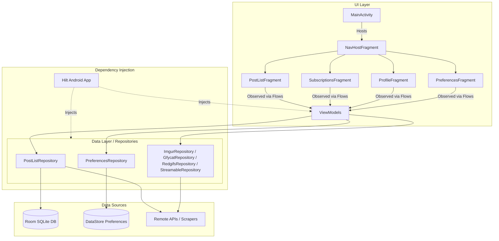

# 01 - Project Overview

This document provides a comprehensive high-level overview of the **Stealth for Reddit** (`unReddit`) application, detailing its purpose, licensing, key features, and general design architecture.

---

## What is Stealth?

**Stealth** is an account-free, privacy-oriented, and feature-rich Reddit client for Android. It is engineered from the ground up to prevent user tracking. The application does not include any option to log in to a Reddit account, protecting your anonymity.

- **Main Goal:** Browse Reddit anonymously, customize subscription feeds, and manage content natively without sacrificing privacy.
- **License:** **GPLv3** (General Public License v3).
- **Package Name (Namespace):** `com.cosmos.unreddit` (production) / `com.cosmos.unreddit.dev` (development).

---

## Key Features

1. **Anonymity & Security**
   - No Reddit account required or allowed.
   - Built-in privacy controls and offline backups.
2. **Subscriptions & Multi-Profiles**
   - Subscribe to subreddits and users.
   - Create separate profiles, each with its own subscriptions, search/view history, and saved items.
3. **Advanced Content Rendering**
   - Media viewers for posts, photos, and videos.
   - Multi-source scraper integrations (e.g., Imgur, Gfycat, Redgifs, Streamable) to display inline videos and media.
   - In-app video/audio rendering powered by **ExoPlayer**.
   - Photo/GIF loading and rendering powered by **Coil**.
4. **Offline Database & History**
   - Cache subscriptions, profiles, and historical items in a local **Room** database.
   - Full-text search and historical navigation offline.
5. **UI Customization**
   - Support for Light, Dark, and **Amoled** (pure black) themes.
   - Left-handed/Right-handed mode optimization for the floating custom bottom navigation bar.

---

## High-Level Architecture

Stealth is built using modern Android Jetpack development practices, implementing a single-activity design with a repository-based MVVM (Model-View-ViewModel) pattern and Hilt Dependency Injection.

### Architectural Diagram

### Flow of Data
1. **User Action:** The user interacts with the UI (e.g., scrolls a subreddit list in `PostListFragment`).
2. **ViewModel Interaction:** The fragment delegates the logic to its associated `ViewModel`.
3. **Repository request:** The `ViewModel` requests data from the relevant `Repository` (e.g., fetching a list of posts).
4. **Caching & Fetching:** The `Repository` coordinates fetching the data from Remote sources (Scrapers/APIs) and caches metadata/history in the `Room` database or updates states in `DataStore`.
5. **Reactive UI:** The UI observes changes as Kotlin `Flow`s or `StateFlow`s, updating elements automatically with `ViewBinding`/`DataBinding`.

---

## Working Principle

This section explains how the app behaves at runtime, from launch to rendering content.

### 1. Account-Free by Design
The app never authenticates. There is **no login flow, no OAuth, no account token** anywhere in the codebase. All content is fetched anonymously via public Reddit endpoints (or privacy-respecting proxies/scrapers). User state (subscriptions, history, saved items, preferences) is stored **locally only** in Room/DataStore.

### 2. Pluggable Data Source (Strategy Pattern)
Reddit's official API increasingly restricts anonymous access, so Stealth supports three interchangeable backends, unified behind the `BaseRedditSource` interface and selected at runtime by `CurrentSource`:

| Selected Source | Mechanism | Endpoint |
|---|---|---|
| **Reddit (official JSON)** | Retrofit + Moshi, `raw_json=1` | `reddit.com` |
| **Teddit (privacy proxy)** | Retrofit against a user-configurable Teddit instance | e.g. `teddit.net` |
| **Scraped HTML** | Jsoup parsing of old Reddit HTML | `old.reddit.com` |

The active source is read from `DataPreferences.RedditSource` (stored in DataStore). `CurrentSource` holds the chosen implementation in a `Mutex`-guarded field and can be swapped live via `setRedditSource()`. Some operations (e.g. search, "load more comments") fall back to the official source even when another is selected, because the proxy/scraper does not implement those endpoints.

### 3. Multi-Profile Isolation
Profiles are first-class entities in Room (`profile` table). Every subscription, history entry, saved post, and saved comment carries a `profile_id` foreign key (cascade delete). Switching profiles instantly scopes all queries to that profile's data via the DAO — there is no global/shared state across profiles.

### 4. Media Resolution Pipeline
A Reddit post often links to external media (Imgur, Gfycat, Redgifs, Streamable). The flow is:
1. The selected source returns a post with a media URL / metadata.
2. `LinkHandler` / `LinkRedirector` / `LinkValidator` resolve and sanitize the URL.
3. Dedicated repositories (`ImgurRepository`, `GfycatRepository`, `RedgifsRepository`, `StreamableRepository`) fetch the real playable/video URL when the host needs an API call.
4. `MediaViewerFragment` renders it via **ExoPlayer** (video/audio) or **Coil + TouchImageView** (images/GIFs). NSFW content is blurred via `BlurTransformation` unless `ContentPreferences` permits it.

### 5. Paging & Reactivity
List screens (feed, search, user history) use Android Paging 3. Each `PagingSource` (e.g. `SmartPostListDataSource`) calls `CurrentSource`, which transparently hits the active backend. Results stream back as `PagingData<Child>` observed through `StateFlow` in the associated `ViewModel`.

### 6. Background Work
Media downloads run through `MediaDownloadWorker` (WorkManager). Failures broadcast `ACTION_DOWNLOAD_RETRY` / `ACTION_DOWNLOAD_CANCEL` intents caught by `DownloadManagerReceiver`, allowing the UI to offer retry/cancel without keeping the app in the foreground.

### 7. Theming & Accessibility
`UnredditApplication` applies the saved theme (Light / Dark / **Amoled**) at startup and configures the Coil `ImageLoader` (GIF decoder selection based on API level). `MainActivity` builds a custom floating bottom-navigation whose gravity flips for **left-handed mode** and animates in/out via `HideBottomViewBehavior`.
