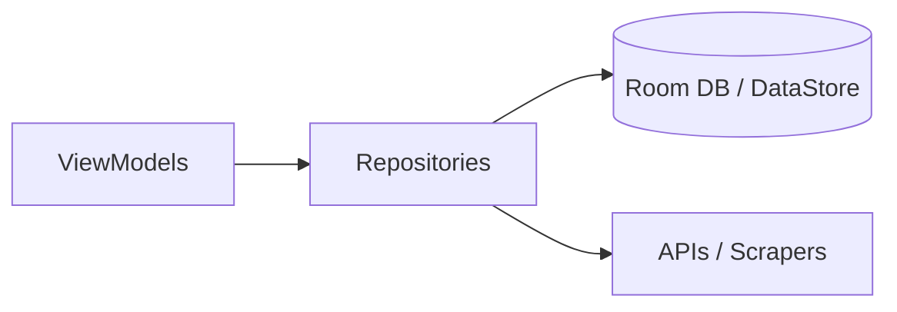

# 04 - Data Layer

This document details the local persistence, remote APIs, scrapers, and repositories that power the Stealth app's data layer.

---

## Architecture Overview

The data layer follows the **Repository pattern**:

Repositories are the single source of truth, coordinating between local caches and remote fetches.

---

## 1. Local Persistence

### Room Database (`data/local/RedditDatabase.kt`)

The app uses Room with schema version 4 and export enabled. Entities:

| Entity | Table | DAO | Purpose |
|---|---|---|---|
| `Subscription` | `subscription` | `SubscriptionDao` | Subreddit subscriptions per profile |
| `History` | `history` | `HistoryDao` | Browsing history (post IDs) |
| `Profile` | `profile` | `ProfileDao` | Local profiles (multi-profile support) |
| `PostEntity` | `post` | `PostDao` | Saved posts |
| `Comment.CommentEntity` | `comment` | `CommentDao` | Saved comments |
| `Redirect` | `redirect` | `RedirectDao` | URL redirect rules (service→redirect) |

Migrations: `MIGRATION_1_2`, `MIGRATION_2_3`, `MIGRATION_3_4` handle schema evolution. A `Callback` inserts a default profile named "Stealth" on first creation.

Type converters in `Converters.kt` handle complex types (lists, enums, etc.).

### DataStore (`di/PreferencesModule.kt`)

App preferences (theme, left-handed mode, NSFW toggle, data source selection) are stored via Jetpack DataStore at `data/repository/PreferencesRepository.kt`.

---

## 2. Remote APIs

### Reddit API (`data/remote/api/reddit/`)

Three data source strategies, all implementing `BaseRedditSource`:

| Source | Class | Mechanism | Base URL |
|---|---|---|---|
| **Official JSON** | `RedditSource` | Retrofit + custom Moshi JSON adapters (raw JSON API) | `reddit.com` |
| **Teddit (privacy)** | `TedditSource` | Retrofit + Teddit HTML/JSON proxy | Configurable (default `teddit.net`) |
| **Scraped HTML** | `RedditScrapingSource` | Jsoup HTML scraper on old Reddit | `old.reddit.com` |

**`CurrentSource`** (`data/remote/api/reddit/source/CurrentSource.kt`) is a strategy-switching wrapper — it delegates to the active source based on user preference (`REDDIT`, `TEDDIT`, or `REDDIT_SCRAP`).

### Third-Party Media APIs

| API | Package | Purpose |
|---|---|---|
| **Imgur** | `api/imgur/` | Fetch albums/images (custom `AlbumDataAdapter`) |
| **Gfycat** | `api/gfycat/` | Fetch video metadata |
| **Redgifs** | `api/redgifs/` | Fetch NSFW video metadata |
| **Streamable** | `api/streamable/` | Fetch video metadata |

Each API is a Retrofit service with a dedicated `Repository`:

- `ImgurRepository.kt`
- `GfycatRepository.kt`
- `RedgifsRepository.kt`
- `StreamableRepository.kt`

### Scrapers

**`data/remote/scraper/Scraper.kt`** — Base abstract class for Jsoup-based HTML parsers. Specific scrapers in `api/reddit/scraper/`:

| Scraper | Purpose |
|---|---|
| `RedditScraper.kt` | Base class for Reddit HTML scrapers |
| `PostScraper.kt` | Parse post listings from HTML |
| `CommentScraper.kt` | Parse comment trees from HTML |
| `SubredditScraper.kt` | Parse subreddit info (sidebar/about) |
| `SubredditSearchScraper.kt` | Parse subreddit search results |
| `UserScaper.kt` | Parse user profiles |
| `Over18Scraper.kt` | Handle NSFW confirmation pages |

### HTTP Interceptors

| Interceptor | Purpose |
|---|---|
| `RawJsonInterceptor.kt` | Ensures raw JSON responses |
| `JsonInterceptor.kt` | Manipulates JSON API requests |
| `TargetRedditInterceptor.kt` | Rewrites URL target for Teddit |
| `RedditCookieJar.kt` | Maintains session cookies for scraped mode |

---

## 3. Paging Data Sources

Located in `data/remote/datasource/`, these implement `PagingSource` for infinite scrolling:

| DataSource | Feeds |
|---|---|
| `SmartPostListDataSource` | Multi-subreddit feed (home, custom multi-reddit) |
| `PostListDataSource` | Generic single-subreddit post list paging |
| `UserPostsDataSource` | User post history |
| `CommentsDataSource` | User comment history |
| `SearchPostDataSource` | Global post search |
| `SearchUserDataSource` | User search |
| `SearchSubredditDataSource` | Subreddit search |
| `SubredditSearchPostDataSource` | Search within a subreddit |

---

## 4. Repositories (`data/repository/`)

| Repository | Responsibilities |
|---|---|
| `PostListRepository` | All post/comment/subscription/history/profile CRUD + saved items |
| `PreferencesRepository` | Read/write DataStore preferences (theme, source, NSFW, etc.) |
| `ImgurRepository` | Fetch Imgur album data |
| `GfycatRepository` | Fetch Gfycat video metadata |
| `RedgifsRepository` | Fetch Redgifs video metadata |
| `StreamableRepository` | Fetch Streamable video metadata |
| `BackupRepository` | Export/import Room database backup |
| `AssetsRepository` | Read bundled assets (e.g., license text) |

---

## 5. Workers (`data/worker/`)

| Worker | Purpose |
|---|---|
| `MediaDownloadWorker` | Background download of media files via WorkManager, with retry/cancel via `DownloadManagerReceiver` |

---

## 6. Receivers (`data/receiver/`)

| Receiver | Purpose |
|---|---|
| `DownloadManagerReceiver` | Handles retry/cancel intents for failed media downloads |
