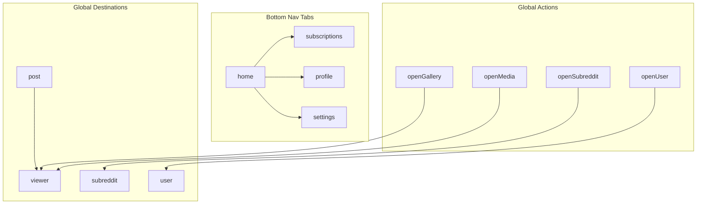

# 06 - UI Layer

This document describes the UI architecture, navigation structure, screens, and ViewModels.

---

## Architecture

The UI layer follows **MVVM** (Model-View-ViewModel) with:
- **Single Activity**: `MainActivity` hosts all screens via `NavHostFragment`
- **ViewBinding** / **DataBinding**: Type-safe view access and optional reactive bindings
- **StateFlow / Flow**: Reactive state management in ViewModels
- **Paging 3**: Infinite scrolling in list screens

---

## Navigation

The navigation graph is defined in `res/navigation/navigation_graph.xml` and uses **Navigation Safe Args** for type-safe argument passing.

### Graph Structure

### Navigation Graphs

| Graph File | Content |
|---|---|
| `navigation_graph.xml` | Root graph — includes all sub-graphs and global actions |
| `home.xml` | Post feed listing (front page, custom multi-reddit) |
| `subscriptions.xml` | Subreddit subscription management |
| `profile.xml` | User profile browsing |
| `settings.xml` | App preferences screen |
| `post.xml` | Post detail with comments |
| `subreddit.xml` | Subreddit browsing |
| `user.xml` | User detail browsing |
| `viewer.xml` | Media viewer (image/video) |
| `search.xml` | Search screen |
| `backup.xml` | Backup/restore screen |

---

## Screens (Feature Packages)

Each UI feature package in `ui/` typically contains a Fragment, ViewModel, Adapter, and related components.

| Package | Fragment(s) | Purpose |
|---|---|---|
| `postlist/` | `PostListFragment` | Paginated subreddit feed |
| `postdetails/` | `PostDetailsFragment` | Post content + threaded comments |
| `mediaviewer/` | `MediaViewerFragment` | Fullscreen ExoPlayer video/audio, image zoom with `TouchImageView` |
| `subreddit/` | `SubredditFragment` | Browse a specific subreddit |
| `user/` | `UserFragment` | Browse a user's posts/comments |
| `subscriptions/` | `SubscriptionsFragment` | Manage followed subreddits |
| `profile/` | `ProfileFragment` | View profile details & saved items |
| `profilemanager/` | `ProfileManagerDialogFragment` | Multi-profile CRUD |
| `preferences/` | `PreferencesFragment` | Theme, source, NSFW, left-handed toggles |
| `search/` | `SearchFragment` | Search posts, subreddits, users |
| `sort/` | `SortDialogFragment` | Sort picker (Hot, New, Top, etc.) |
| `commentmenu/` | `CommentMenuBottomSheet` | Long-press actions on comments |
| `postmenu/` | `PostMenuBottomSheet` | Long-press actions on posts |
| `linkmenu/` | `LinkMenuBottomSheet` | Long-press actions on links |
| `redditsource/` | `RedditSourceDialogFragment` | Choose data source (Reddit/Teddit/Scraped) |
| `policydisclaimer/` | `PolicyDisclaimerDialogFragment` | Privacy disclaimer on first launch |
| `backup/` | `BackupFragment`, `BackupChoiceFragment`, `BackupLocationFragment`, `BackupOperationFragment`, `BackupLoadingFragment` | Export/import DB backup |
| `about/` | `AboutFragment` | App info, license, credits |
| `privacyenhancer/` | `PrivacyEnhancerFragment` | Privacy enhancement settings |
| `loadstate/` | Shared load-state UI | Paging loading/error/empty indicators |
| `base/` | `BaseFragment`, `BaseViewModel` | Base classes for UI and ViewModels |
| `common/` | Common widgets | Dividers, spacers, shared layouts |

---

## Key ViewModels

| ViewModel | Scope | Exposes |
|---|---|---|
| `UiViewModel` | Activity scope | Left-handed mode, navigation visibility, policy disclaimer state |
| Per-feature ViewModels | Fragment scope | Paging data, sort state, UI actions |

---

## Media Player

Video/audio playback uses **ExoPlayer** via `ExoPlayerHelper.kt` in the `util/` package. It handles:
- Player lifecycle binding
- Playback controls (play, pause, seek)
- Audio focus handling

Images and GIFs use **Coil** (`ImageLoader` configured in `UnredditApplication`) with crossfade and GIF decoder support for API < 28.
